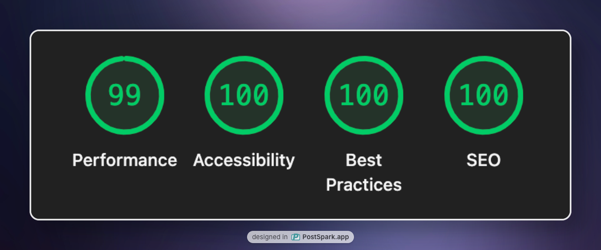

<a name="readme-top"></a>

<a href="https://www.1chooo.com">
  
</a>

<div align="center">
  <a href="https://nextjs.org">
    
  </a>
  <a href="https://github.com/1chooo/1chooo.com/blob/main/LICENSE">
    
  </a>
  <a href="https://docs.1chooo.com">
    
  </a>
  <a href="https://github.com/1chooo/1chooo.com/stargazers">
    
  </a>
</div>

## Abstract

Welcome to [**1chooo.com**](https://github.com/1chooo/1chooo.com) 👋 A clean, modern portfolio + blog site to share your work, ideas, and projects -- all built with Next.js, TypeScript, and Tailwind CSS.

It's fast, responsive, SEO-friendly, and super easy to customize. Make it yours and start sharing. 🚀

## Features

### Tech Stack Highlights

- Next.js 15 with App Router
- TypeScript with strict configuration
- Tailwind CSS for styling
- Turborepo for monorepo management

### Blogging Essentials

- Markdown support for blog posts
- Comment system
- RSS feed for blog posts
- Sitemap generation

### UI & UX Enhancements

- Skeleton loading for better user experience
- Responsive design for mobile and desktop
- GitHub calendar heatmap to showcase contributions
- Shiki for code syntax highlighting
- Motion for animations

### Performance & SEO

- Lighthouse score of nearly **100**
- SEO optimized with meta tags and `JSON-LD`
- Open graph images using `next/og`

<div align="center">
  
</div>

### Dev Experience

- ESLint and Prettier for code quality
- Conventional commit messages

## Contributing

Please refer to the [Contributing Guideline] for detailed information on how to start the app locally and contribute to this project.

[Contributing Guideline]: https://docs.1chooo.com/contributing

[Pull Requests](https://github.com/1chooo/1chooo.com/pulls) and [reporting issues](https://github.com/1chooo/1chooo.com/issues) are welcome 🫵🏻 in our [GitHub repository](https://github.com/1chooo/1chooo.com)!

## Getting Started

> [!NOTE]
> We choose [`pnpm`](https://pnpm.io/) as our package manager. Make sure you have it installed before running the following commands.

```shell
$ git clone git@github.com:1chooo/1chooo.com.git
$ cd 1chooo.com
$ pnpm install
```

### Run the Web App

```shell
$ cd apps/web
$ pnpm run dev   # Open http://localhost:3000 with your browser to see the result.
```

## Acknowledgments

This project was made possible thanks to the amazing open-source community.

A special thanks to [@codewithsadee](https://github.com/codewithsadee) for the excellent [vcard-personal-portfolio](https://github.com/codewithsadee/vcard-personal-portfolio), which served as the foundation for this project.

The project also incorporates and adapts various open-source projects, including:

- [rehype](https://github.com/rehypejs/rehype)
- [remark](https://github.com/remarkjs/remark)
- [Giscus](https://giscus.app/)
- [react-scroll-motion](https://github.com/1000ship/react-scroll-motion)
- [GitHub Calendar](https://github.com/grubersjoe/react-github-calendar)

Additionally, I drew inspiration from several incredible projects, including:

- [honghong.me](https://honghong.me)
- [leerob.com](https://leerob.com)
- [bntw.dev](https://bntw.dev)
- [webtech-note.com](https://webtech-note.com)
- [michaelangelo.io](https://michaelangelo.io)
- [iamsahaj.xyz](https://iamsahaj.xyz)
- [jinrup.dev](https://www.jinrup.dev)

...and many others I can't recall but deeply appreciate.

## Authors

- **Chun-Ho (Hugo) Lin** <sup>[Website](https://www.1chooo.com) | [GitHub](https://github.com/1chooo) | [E-mail](mailto:hugo970217@gmail.com)</sup>

## Deploy on Vercel

The easiest way to deploy 1chooo.com app is to use the [Vercel Platform](https://vercel.com/new?utm_medium=default-template&filter=next.js&utm_source=create-next-app&utm_campaign=create-next-app-readme) from the creators of Next.js.

Check out [Next.js deployment documentation](https://nextjs.org/docs/app/building-your-application/deploying) for more details.

## License

> [!IMPORTANT]
> This work is licensed under a [Creative Commons Attribution 4.0 International License][cc-by] by [Chun-Ho (Hugo) Lin][1chooo-com].
>
> [cc-by]: http://creativecommons.org/licenses/by/4.0/
>
> 1. You are free to use this code as inspiration.
> 2. Please do not copy it directly.
> 3. Crediting the author is appreciated.

This software can be modified and reused without restriction.
The original license must be included with any copies of this software.
If a significant portion of the source code is used, please provide a link back to this repository.

Please remove all of my personal information by running `pnpm run delete`.

Made with 🖤 by [@1chooo][1chooo-com]

[1chooo-com]: https://www.1chooo.com

<p align="right" style="font-size: 14px; color: #555; margin-top: 20px;">
    <a href="#readme-top" style="text-decoration: none; color: #007bff; font-weight: bold;">
        ↑ Back to Top ↑
    </a>
</p>
