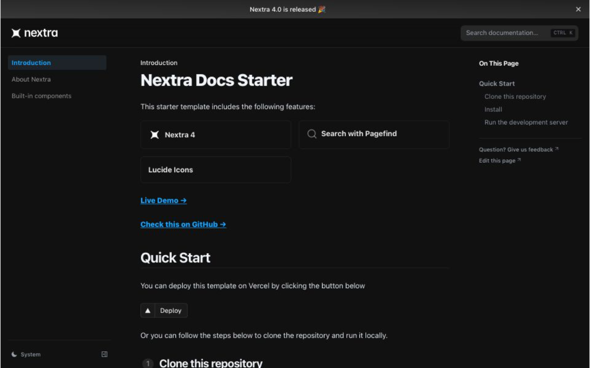

# Nextra Docs Starter 

This starter template includes the following features:

- [x] **Nextra 4**
- [x] **Search with Pagefind**
- [x] **Lucide Icons**

[**Live Demo →**](https://nextra-docs-starter.vercel.app)

[](https://nextra-docs-starter.vercel.app)

## Quick Start

You can deploy this template on Vercel by clicking the button below

[](https://vercel.com/new/clone?repository-url=https%3A%2F%2Fgithub.com%2Fphucbm%2Fnextra-docs-starter)

## Local Development

### Clone this repository

Using the GitHub CLI:
```bash
gh repo clone phucbm/nextra-docs-starter
```

### Install
```bash
pnpm i
```

### Run the development server
```bash
pnpm dev
```

## License

This project is licensed under the MIT License.
