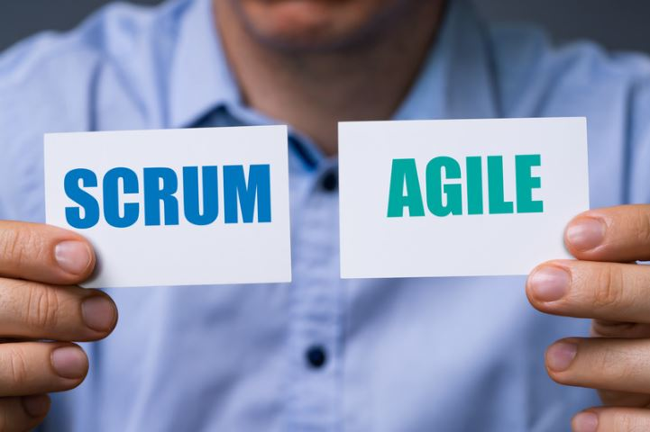
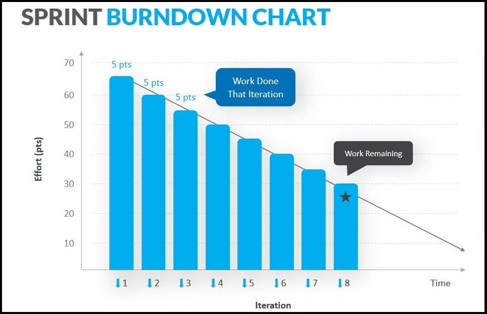

# 使用 Scrum Workflow 帶領開發團隊：Roles, Benefits, and Steps to Take

當初第一次碰到 Scrum 是在 2023 年暑假的第一份實習中，我們就是用 Scrum 來管理專案的。之所以會用 Scrum 開發就是因為團隊是做 AI 相關的軟體開發，因此為了應應開發中專案的不確定性，我們採用了 Scrum 這個敏捷開發的方法。如此我們可以更快地對各種變因做出應對，並且保有專案有彈性且都在進度條之上。而最近我也在下一間的公司實習中，將帶領實習生們一起用 Scrum 開發出 Final Project，因此我也在這邊整理了一些 Scrum 的相關資訊，希望能夠幫助到大家。

## What is Scrum?

Scrum 到底是甚麼？Scrum 是一個輕量級的框架，用來幫助人們、團隊和組織透過適應性解決複雜問題而產生價值。適應性就是要能夠具有彈性，並且能夠快速地對變化做出應對。Scrum 是一個框架，而不是一個方法、流程或技術。Scrum 通過 Scrum 團隊、Scrum 事件、Scrum 週期和 Scrum 工件來實現這一目標，實現的要素我們會在後文中提及。

Scrum 框架是非常簡單的，他沒有過多嚴格地要求，反而更注重的是有沒有照著 Scrum 的精神來做，以及是否創造出相對應的交付價值。因此不會提供詳細的指導原則，也就是命令的狀態，而是透過 Scrum 的規則來指導人們的關係和互動，因此在框架內可以使用各種流程、技術和方法。Scrum 包裹著現有的實踐，或者使它們變得不再必要。Scrum 使當前管理、環境和工作技術的相對效能變得可見，以便進行改進。

## Successful use of Scrum

Scrum 團隊的成功，利基在團隊成員要能夠更加精通地貫徹以下五個價值觀：**承諾、專注、開放、尊重和勇氣**。

這五項價值觀旨在增進團隊的信心，使成員之間更為緊密並相互支持。團隊的主要關注點是在最終目標上，努力實現最佳進展。因此，團隊成員相互認可彼此的能力，並尊重與他們一同工作的夥伴。Scrum 團隊成員必須具備勇氣，去做正確的事情，解決複雜的問題。在面對困難時，他們需要勇敢地做出決定，並確保工作朝著正確的方向前進。這樣的過程中需要大量的訊息同步、工作安排、討論和決策。透過這樣的方式，團隊能夠建立起信任。

## Role of Scrum Team

### Product Owner

Product Owner 在整個 Scrum 流程中就像是一個小 CEO，他們負責做出決定，並且要能夠連結相對應的利益價值，因此需要定義出 Sprint 的目標、管理產品的 Backlog 並且也要定義出產品的願景，確保產品的交付價值。

過程會需要定義出產品的 roadmap 並且根據這個 roadmap 來優先排序 Backlog，並且確保 Backlog 會定期地被更新，同時也要有能力決策過時的專案該何時停損。這些 Backlog 包含了 features, [user stories](https://www.wrike.com/agile-guide/user-stories-guide/), tasks, and deliverables，而 Product Owner 的責任還會確保這些 Backlog 會被定期地更新，以真正反映出產品的價值。

### Scrum Master

Scrum Master 在團隊中為建立 Scrum 秩序的角色，也可以說是 Scrum 的守護者。Scrum Master 負責確保團隊遵循 Scrum 流程，並且也要確保團隊的運作是有效率的。Scrum Master 也會協助團隊解決問題，在過程中調節可能會出現的問題，將可能會讓 sprint 有偏離的內容查找出來，做出修正，將專案的方向帶回正軌。

### Development Team

Development Team 不會只是一個人的存在，會是一群共同協作的團隊，在這個團隊中每個人都會有各自擅長的職能，可能是各種類型的工程師，會根據專案所需的技能來決定團隊的組成，是一群透過實作，把產品價值實作的的人。

## How to start Scrum Workflow?

在 Scrum 中，有五個事件，分別是 Sprint、Sprint Planning、Daily Scrum、Sprint Review 和 Sprint 中實踐。每個事件都是可以對 Scrum 做出檢查以及應對的機會。讓我們可以檢視整個流程的發展，甚至可以做到優化我們的流程，因此我們需要將這些事件視為一個整體，不可遺漏任何一個，因為對我們都是非常重要的存在。

理想情況下，所有事件都應在同一時間和地點舉行，以減少複雜性。

### Sprint

在 Scrum 工作流最重要的就是 -- Sprint，在 [Official Scrum Guide](https://scrumguides.org/scrum-guide.html) 中是這樣描述地："Sprints are the heartbeat of Scrum, where ideas are turned into value."，這也就代表了 Sprint 幾乎是 Scrum 的核心，能不能將產品交付價值實現的關鍵。

在 Sprint 期間，我們會堅持著我們起初的目標，我們不會做出偏離結果的決定，更不會因為一些小問題而影響到 Sprint 的進度，我們也可能會隨著糾結點的釐清而有所應對以及調整。不過當 Sprint 的目標變得過時，Sprint 可能會被取消，只有產品負責人有權取消 Sprint。

Sprint 是一個短期的小目標，當 Sprint 的執行時間太長時，Sprint 目標可能會變得無效，複雜性可能會增加，風險也同樣會增加。較短的 Sprint 可以更激盪我們對專案的理想實現，也可以讓我們能夠對未來的變數做出快速反應。

### Sprint Planning

在每個 Sprint 週期中，我們最先做的就是 Planning，我們會需要透過組織會議的方式來實踐，過程中我們會需要討論整個 Sprint 的方向，並且也會需要確保每個人都能夠清楚地知道自己的責任，以及如何去實踐這個 Sprint 的目標。我們也需要討論在我們現有的人力資源下要如何去完成最終的目標。

因此我們需要去發想，Sprint 所能帶來的價值、我們可以做到甚麼程度？我們又該怎麼選擇我們應當完成的工作內容？我們又該如何去分配我們的工作？這些都是 Sprint Planning 會需要討論的內容。事前充分的準備可以讓我們更了解我們的目標，同時也對成員的工作內容有所了解，增進團隊之間的信任。

### Daily Scrum

Daily Scrum 就是我們日常的工作流程中，我們需要做的 Task，目的是讓我們能夠朝著當初制定的目標去推進，因此在這邊我們會有許多的討論，包含了 Daily Sync Meeting，過程中我們可能會因為許多變因而有所調整，因此在整個 Sprint 中是我們花費最大量時間的一環，可以想像一切的努力實踐都是從這邊開始的。

至於 Daily Sync 不僅可以讓我們了解整個 Sprint 是在推進的，我們也可以了解其他合作夥伴的進度，以增進團隊間的溝通、互助、信任，讓目標更加清晰。

同時我們會搭配一些工具去追蹤我們的進度像是 Burndown Chart, Gantt Chart 等等，我們可以透過進度的曲線去了解我們的進度是否符合當初的規劃，以及是否有需要調整的地方。

### Sprint Review

Sprint Review 是個可以讓我們檢核所有成果的時刻，我們將可以直接且量化地看出我們在整個 Sprint 所達成的結果，我們也可以看出當初的規劃內容是否得以驗證，更能夠為下一次的 Sprint 看出專案未來的願景。

### Sprint Retrospective

Sprint Retrospective 可以讓我們檢視整個工作流程，同時也是準備進入下一個 Sprint 的事前準備，這過程可以讓我們優化現有的流程，以及調整團隊的協作方法，這時所有成員都可以提出我們應當保留的做法，又或是因應當前的狀況做出調整，以確保我們的開發品質。

## Conclusion

其實在 Scrum 開發中還有大量的內容需要去學習，畢竟這個初衷就是可以在快速變化中，讓決策變得更有彈性，並且能夠讓我們將專案的價值給體現出來。因此上述這些 Scrum 的 Workflow 只是一個開始，希望大家可以透過這些資訊，更了解 Scrum 的精神，並且能夠在未來的專案中更好地運用 Scrum 的精神。

## References
- [The 2020 Scrum Guide](https://scrumguides.org/scrum-guide.html)
- [What is Scrum?](https://codecoda.com/en/blog/entry/what-is-scrum)
- [What Is Scrum Workflow?](https://www.wrike.com/scrum-guide/faq/what-is-scrum-workflow/)
- [User story templates with step-by-step guidance](https://www.aha.io/roadmapping/guide/requirements-management/what-is-a-good-feature-or-user-story-template)
- [What is a Scrum workflow?](https://miro.com/agile/what-is-a-scrum-workflow/)
- [What is Scrum?](https://www.scrum.org/resources/what-scrum-module)
- [Scrum Workflow: Roles, Benefits, and Steps to Take](https://clickup.com/blog/scrum-workflow/)
- [Scrum Workflow - A Step by Step Guide](https://www.sprintzeal.com/blog/scrum-workflow)