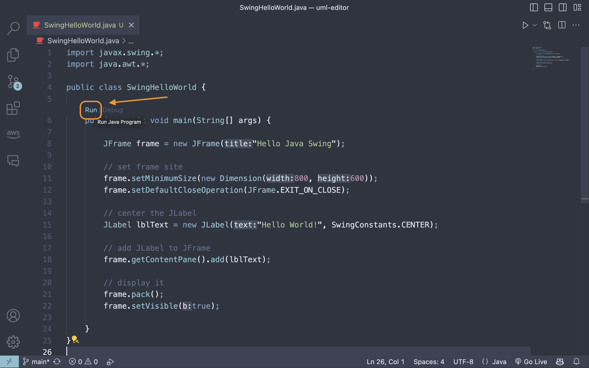
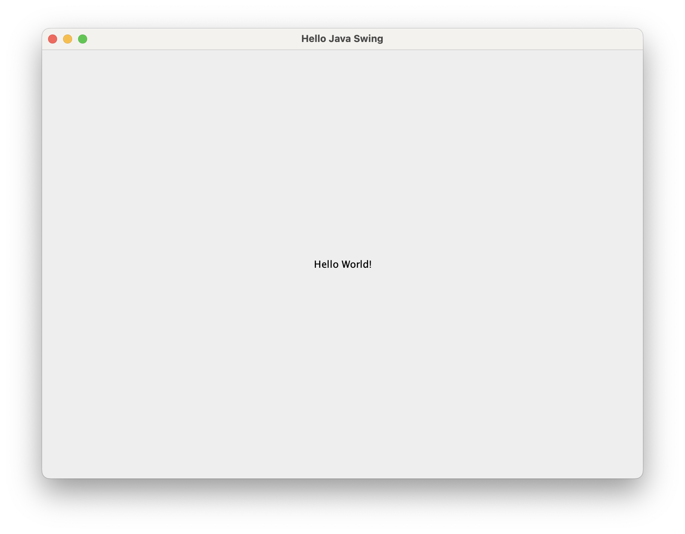

# 在 Mac 上使用 Visual Studio Code 建立你的第一個 Java Swing Hello World App

在之前的文章中，我們示範了如何在 Mac 上使用 Visual Studio Code 建立 Java 開發環境👉🏻 [如何在 MacOS 安裝 Java + VS Code 開發組合環境](https://medium.com/@1chooo/%E5%A6%82%E4%BD%95%E5%9C%A8-macos-%E5%AE%89%E8%A3%9D-java-vscode-%E9%96%8B%E7%99%BC%E7%B5%84%E5%90%88%E7%92%B0%E5%A2%83-ebeae00c20e3)。不過我們今天想帶大家入門 Java 的圖形介面程式（GUI），因此在本文中，將告訴大家如何透過 25 行程式碼創建第一個 Java Swing Hello World App。

首先建立一個名為 `SwingHelloWorld.java` 的檔案。

我們要先做視窗的建立，首先我們要建立一個 `JFrame` 物件，這個物件是一個視窗的容器，我們可以將其他的元件放入這個容器中。

```java
JFrame frame = new JFrame("Hello Java Swing");

frame.setMinimumSize(new Dimension(800, 600));  // set frame size
frame.setDefaultCloseOperation(JFrame.EXIT_ON_CLOSE); // Exit the application when the window is closed
```

接著我們要建立一個 `JLabel` 物件，這個物件是一個文字標籤，我們可以將文字放入這個標籤中。

```java
// center the JLabel
JLabel lblText = new JLabel("Hello World!", SwingConstants.CENTER);
```

我們要組合這兩個元件，將 `JLabel` 放入 `JFrame` 中。
```java
// add JLabel to JFrame
frame.getContentPane().add(lblText);
```

最後我們要顯示這個視窗，我們用到 `pack()`，並且設定 `Visible`。
```java
// display it
frame.pack();
frame.setVisible(true);
```


完整的程式碼如下：

```java
import javax.swing.*;
import java.awt.*;

public class SwingHelloWorld {

    public static void main(String[] args) {

        JFrame frame = new JFrame("Hello Java Swing");

        // set frame site
        frame.setMinimumSize(new Dimension(800, 600));  // set frame size
        frame.setDefaultCloseOperation(JFrame.EXIT_ON_CLOSE);   // Exit the application when the window is closed

        // center the JLabel
        JLabel lblText = new JLabel("Hello World!", SwingConstants.CENTER);

        // add JLabel to JFrame
        frame.getContentPane().add(lblText);

        // display it
        frame.pack();
        frame.setVisible(true);

    }
}
```

接著直接幫我點選 `Run` 按鈕，你將會看到一個視窗出現，上面寫著 `Hello World!`。



成品如下，如果看到 Hello World 就代表你成功啦！



這樣就完成了你的第一個 Java Swing Hello World App，希望這篇文章對你有幫助，也祝大家可以開發出屬於自己的應用，未來也會有更多 Java Swing 的分享。

## Reference
- [JFrame JavaDoc](https://docs.oracle.com/en/java/javase/11/docs/api/java.desktop/javax/swing/JFrame.html)
- [JLabel JavaDoc](https://docs.oracle.com/en/java/javase/11/docs/api/java.desktop/javax/swing/JLabel.html)